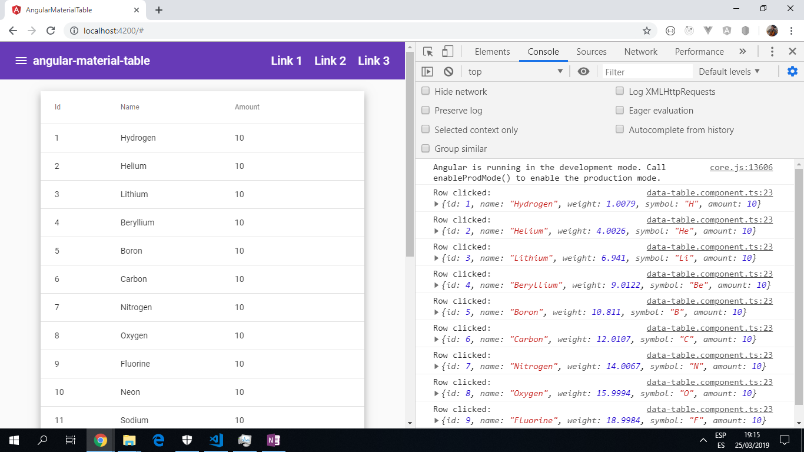

# Angular Material Table

App using the [Angular Material design component library](https://material.angular.io/) to add a table using mat-table and experiment with different themes.

*** Note: to open web links in a new window use: _ctrl+click on link_**

## Table of contents

* [General info](#general-info)
* [Screenshots](#screenshots)
* [Technologies](#technologies)
* [Setup](#setup)
* [Features](#features)
* [Status](#status)
* [Inspiration](#inspiration)
* [Contact](#contact)

## General info

Table of periodic elements used to provide data for columns.

## Screenshots



## Technologies

* [Angular CLI](https://github.com/angular/angular-cli) version 7.0.6
* [Angular Material](https://material.angular.io/)

– – – – -

## Setup

Run `ng serve` for a dev server. Navigate to `http://localhost:4200/`. The app will automatically reload if you change any of the source files.

Run `ng build` to build the project. The build artifacts will be stored in the `dist/` directory. Use the `--prod` flag for a production build.

Run `ng test` to execute the unit tests via [Karma](https://karma-runner.github.io).

Run `ng e2e` to execute the end-to-end tests via [Protractor](http://www.protractortest.org/).

## Code Examples

```html
<!-- Data passed to the mat-table component using the dataSource input.
Mat-sort header is used to allow each column to be sorted in asc or desc order -->
<div class="mat-elevation-z8 data-table">
  <table mat-table class="full-width-table" [dataSource]="dataSource" matSort aria-label="Elements">
    <!-- Id Column -->
    <ng-container matColumnDef="id">
      <th mat-header-cell *matHeaderCellDef mat-sort-header>Id</th>
      <td mat-cell *matCellDef="let row">{{row.id}}</td>
    </ng-container>

    <!-- Name Column -->
    <ng-container matColumnDef="name">
      <th mat-header-cell *matHeaderCellDef mat-sort-header>Name</th>
      <td mat-cell *matCellDef="let row">{{row.name}}</td>
    </ng-container>

    <!-- Amount Column -->
    <ng-container matColumnDef="amount">
      <th mat-header-cell *matHeaderCellDef mat-sort-header>Amount</th>
      <td mat-cell *matCellDef="let row">{{row.amount}}</td>
    </ng-container>

    <!-- Sticky header added, onRowClick function added -->
    <tr mat-header-row *matHeaderRowDef="displayedColumns; sticky: true"></tr>
    <tr mat-row *matRowDef="let row; columns: displayedColumns;" (click)="onRowClicked(row)"></tr>
  </table>

  <!-- Add a paginator -->
  <mat-paginator #paginator
      [length]="dataSource.data.length"
      [pageIndex]="0"
      [pageSize]="50"
      [pageSizeOptions]="[25, 50, 100, 250]">
  </mat-paginator>
</div>

```

## Features

* Clicking on a row will console.log the data in that row.
* Table now has a sticky header.

## Status & To-Do List

* Status: Project is a working

* To-Do: Add to the onRowClicked(row) function. Add styling, especially a coloured header.

## Inspiration

Project inspired by these 4 Youtube tutorials. Note: the Custom Theme Video 4 was out of date due to the Ionic changing to version 4.0:
[1. Intro & Setup](https://www.youtube.com/watch?v=u679SQsfRVM&list=PL55RiY5tL51p2R1L8sxaYlzmWh6yIrX8k&index=1),

[2. Data Table](https://www.youtube.com/watch?v=ao-nY-9biWs&list=PL55RiY5tL51p2R1L8sxaYlzmWh6yIrX8k&index=2),

[3. Responsive Navigation](https://www.youtube.com/watch?v=Q6qhzG7mObU&list=PL55RiY5tL51p2R1L8sxaYlzmWh6yIrX8k&index=3),

[4. Custom Theme](https://www.youtube.com/watch?v=EBnTZwr0RSs&list=PL55RiY5tL51p2R1L8sxaYlzmWh6yIrX8k&index=4)

## Contact

Created by [ABateman](https://www.andrewbateman.org) - feel free to contact me!
